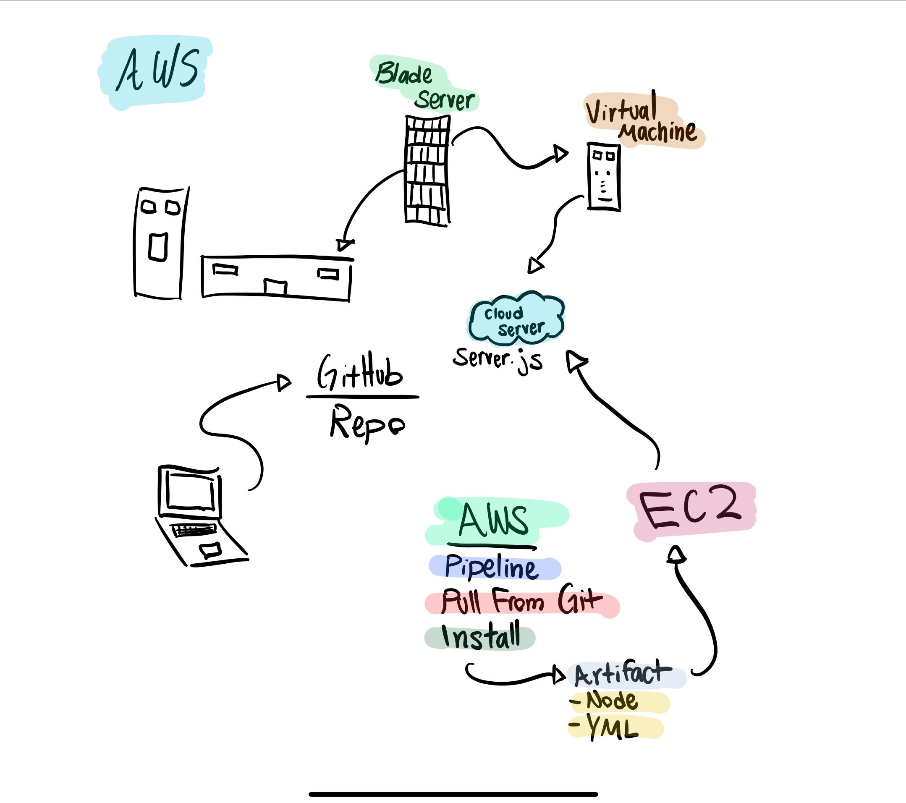

# LAB - 19

# AWS Socket Server

### Authors: Pratiibh Bassi

### Links and Resources
* [submission PR](https://github.com/pratiibh-401-advanced-javascript/lab-19/pull/1)
* [Backend](http://Lab19-env.zx8e8cbmdt.us-east-2.elasticbeanstalk.com)
* [AWS](https://us-east-2.console.aws.amazon.com/codesuite/codepipeline/pipelines/lab-19/view)

### Running the App
* node app.js
* node console.js

### UML

* HD version of class UML (credit to Brandyn)